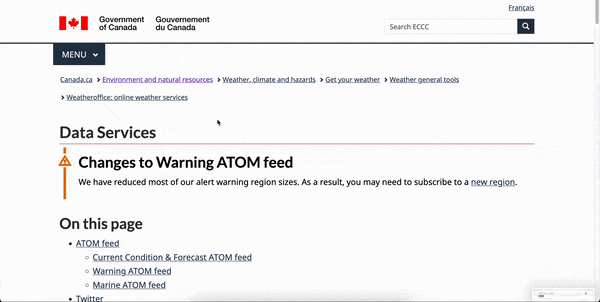

# MMM-CanadianPublicWeatherAlerts

A module for [MagicMirror](https://github.com/MichMich/MagicMirror) to display [Canadian Public Weather Alerts](https://weather.gc.ca/warnings/index_e.html) provided by Environment Canada.

Description:

Gets weather watches, warnings, and advisories for user specified regions. Using data published by Environment Canada.


## Installation

1. From your modules folder, clone the repository by running `git clone https://github.com/aSouchereau/MMM-CanadianPublicWeatherAlerts.git`
2. Install the required dependencies by running `npm install`
3. Add the module to the mirror's config. (See below)
4. Find the code for your region(s) and enter them into the config file.

```
{
  module: "MMM-CanadianPublicWeatherAlerts",
  position: "top_center",
  config: {
      lang: 'en',
      regions: [
        {
          code: "on16"
        },
        {
          code: "on17"
        },
        {
          code: "bc46"
        }
      ],
      updateInterval: 60000,
      animationSpeed: 1000,
      displayInterval: 5000
  }
}
```

## Options
| **Option**        | **Description**                                                                                                                                                                                                        | **Default** | **Required** |
|-------------------|------------------------------------------------------------------------------------------------------------------------------------------------------------------------------------------------------------------------|-------------|--------------|
| `lang`            | Sets the language the alerts are displayed in. English and French only. Set as either en or fr.                                                                                                                        | en          |              |
| `regions`         | Sets the regions this module will display alerts for. See instructions below to find the region code for your area.                                                                                                    |             | x            |
| `updateInterval`  | Sets the interval between each alert update. By default, this module will get new alert data every `60 seconds`.                                                                                                       | 60000       |              |
| `displayInterval` | Sets the amount of time each alert is displayed for. Default value is `5 seconds`.                                                                                                                                     | 5000        |              |
| `animationSpeed`  | Sets the speed of the cross-fade between each alert. Set to `0` to disable. Default value is `1 second`.                                                                                                               | 1000        |              |
| `showNoAlertsMsg` | If set to true, the module will display a "No alerts in effect" message for each region.                                                                                                                               | false       |              |
| `periodicSync`    | If set to true, the module will periodically resend the config and request a new update from the server. This is helpful for server only installations where a client may become "out of sync" if the server restarts. | false       |              |
| `syncInterval`    | Sets the amount of time between each sync. By default (if enabled), the module will sync with the server once every 10 minutes.                                                                                        | 600000      |              |


### Regions
** Note: Environment Canada has recently redesigned their weather alerts system. It may now be more difficult to find your region code from the alerts page. You should now use the atom feeds page linked below.

Environment Canada publishes weather alerts for regions across the country. Regions are represented by a region code that follows the format of `xx00` or `xxrm00`.

- `xx` is a two character province/territory code.
- `rm` may or may not be present in the code depending on your region. If so, be sure to include this in the config value.
- `00` is a 1-3 digit number representing a region located in the province/territory.

To find the code for your desired region visit [Env Canada Atom Feeds](https://www.canada.ca/en/environment-climate-change/services/weather-general-tools-resources/weatheroffice-online-services/data-services.html) and scroll down to search for it in the table.



The region code can be found at the end of the url in the Atom URL column.

Copy the region code into your config. Repeat for any other regions you want to add.

```
{
  module: "MMM-CanadianPublicWeatherAlerts",
  position: "top_center",
  config: {
      lang: 'en',
      regions: [
        {
          code: "onrm26"
        },
        {
          code: "on17"
        },
        {
          code: "bc46"
        }
      ],
      updateInterval: 60000,
      animationSpeed: 1000,
      displayInterval: 5000
  }
}
```


### Intervals

#### updateInterval
- When the module starts, and after each interval specified by `updateInterval`, the module will fetch new data for each configured region. 
- The interval should be long enough for the client to have enough time to display all alerts.
- If you notice that not all alerts are being displayed, it could be that the module doesn't have enough time to display all the alerts between each update. 
- To remedy this, you can either increase the `updateInterval`, or decrease the `displayInterval` and `animationSpeed`.
- **Please be aware** that many regions contain subregions, each with their own alerts.

#### displayInterval and animationSpeed
`displayInterval` is the amount of time a single alert is displayed for, not including the animation speed. For example: 
- Assume a `displayInterval` of 5 seconds, and an `animationSpeed` of 1 second.
- The module will display a new alert every 6 seconds.

#### syncInterval
- Sets the amount of time between each sync.
- It is recommended to set this value to something longer than your updateInterval. 

## Custom Styling

Each element is assigned a class that denotes its type. You can target this class in the mirror's `custom.css` file.

| **Element** | **Class**      |
|-------------|----------------|
| Title       | `alert-title`  |
| Location    | `alert-region` |
| Time Since  | `alert-time`   |
