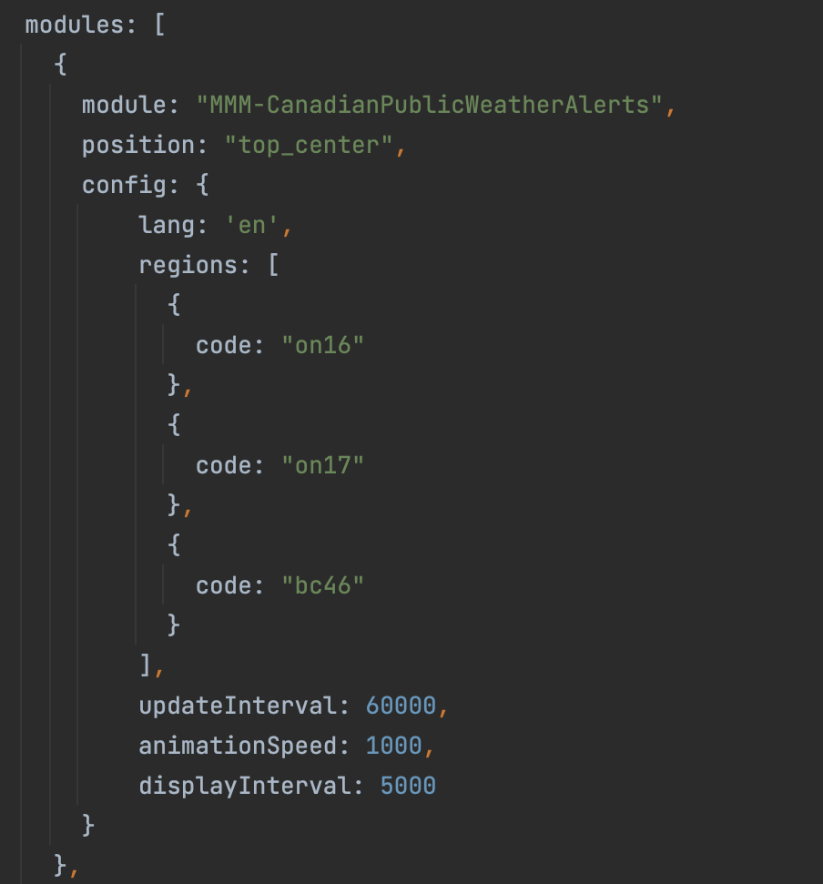

# MMM-CanadianPublicWeatherAlerts

A module for [MagicMirror](https://github.com/MichMich/MagicMirror) to display [Canadian Public Weather Alerts](https://weather.gc.ca/warnings/index_e.html) provided by Environment Canada.

## Options
| **Option**        | **Description**                                                                                                     | **Default** | **Required** |
|-------------------|---------------------------------------------------------------------------------------------------------------------|-------------|--------------|
| `lang`            | Sets the language the alerts are displayed in. English and French only. Set as either en or fr.                     | en          |              |
| `regions`         | Sets the regions this module will display alerts for. See instructions below to find the region code for your area. |             | x            |
| `updateInterval`  | Sets the interval between each alert update. By default, this module will get new alert data every `60 seconds`.    | 60000       |              |
| `displayInterval` | Sets the amount of time each alert is displayed for. Default value is `5 seconds`.                                  | 5000        |              |
| `animationSpeed`  | Sets the speed of the cross-fade between each alert. Set to `0` to disable. Default value is `1 second`.            | 1000        |              |

### Regions
Environment Canada publishes weather alerts for regions across the country. Regions are represented by a region code that follows the format of `aa00`.
- `aa` is a two character province/territory code.
- `00` is a 1-3 digit number representing a region located in the province.

To find the code for your desired region visit [Env Canada Alerts Page](https://weather.gc.ca/warnings/index_e.html) and locate it on the map.

The region code can be found at the end of the url on your regions alert page.

Copy the region code into your config. Repeat for any other regions you want to add.

